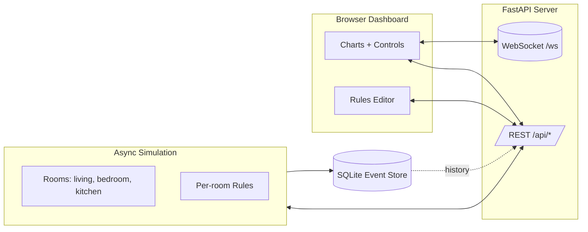

# IoT Smart Home Automation (Simulation)

  

A production‑grade, multi‑room smart home simulator with real‑time dashboard, WebSocket streaming, rules editor, and persistent history.


3D visual overview
```
      ____   ____   ____                 ______  __   __
     / __ \ / __ \ / __ \   ___  ____  / __/ / / /  / /
    / / / // / / // / / /  / _ \/ __/ _\ \/ /_/ /  / / 
   / /_/ // /_/ // /_/ /  / , _/ /__ /__/\____/  /_/  
  /_____/ \____/ \____/  /_/|_|\___/  smart home sim

      ┌──────────────────────── Isometric Architecture ────────────────────────┐
      │                                                                        │
      │    ┌───────────┐        WS (JSON events)        ┌─────────────────┐   │
      │    │  Browser  │◀──────────────────────────────▶│  FastAPI + WS   │   │
      │    │  Dashboard│        REST (GET/POST)         │  /api + /ws     │   │
      │    └─────┬─────┘                                  └──────┬────────┘   │
      │          │                                              │            │
      │          │                                              │            │
      │    ┌─────▼─────┐    periodic sensor ticks     ┌─────────▼────────┐   │
      │    │  Charts   │◀────────────────────────────▶│  Async Simulation │   │
      │    │  Controls │  rules, env dynamics, actuators  rooms:{...}    │   │
      │    └─────┬─────┘                                   └─────┬────────┘   │
      │          │                                               │            │
      │   export ▼                                               ▼ events     │
      │    CSV/JSON                                   SQLite event store      │
      └───────────────────────────────────────────────────────────────────────┘
```

Mermaid architecture



Features
- Multi-room engine: living, bedroom, kitchen (humidity + smart plug)
- Real-time dashboard: temp/light/motion/humidity charts with range (15m/1h/24h) and custom date ranges
- Controls: fan, lightbulb, smart plug, thermostat setpoint
- Rules editor: YAML per-room overrides (darkness threshold, temp_high, motion_light_on_seconds)
- Persistence: SQLite event store; history and exports (CSV/JSON)

Quick start
```bash
# install
pip install -U pip
pip install -e .

# run server
env UVICORN_WORKERS=1 python -m smarthome.main serve --reload
# open http://localhost:8000
```

CLI
```bash
# run headless for N seconds
python -m smarthome.main simulate --seconds 15
```

Configuration
- config.yaml: global defaults (thresholds, tick intervals)
- rules.yaml: per-room overrides edited live via the Rules button

Rules YAML example
```yaml
rooms:
  living:
    temp_high: 25.0
    light_dark: 30.0
    motion_light_on_seconds: 120
  bedroom:
    temp_high: 24.5
```

REST API
- GET /api/state – snapshot of rooms, sensors, actuators
- GET /api/rooms – room list
- POST /api/rooms/{room}/actuators/{id} – command actuator (JSON)
- GET /api/history?room=ROOM&sensor_id=SID&window=15m|1h|24h
- GET /api/history?room=ROOM&sensor_id=SID&start=EPOCH&end=EPOCH
- GET /api/export?room=ROOM&sensor_id=SID&window=...&format=csv|json
- GET /api/export?room=ROOM&sensor_id=SID&start=...&end=...&format=csv|json
- GET /api/export_all?room=ROOM&window=...&format=csv|json

WebSocket events
```json
{"type":"reading","room":"living","device_id":"temp","metric":"temperature","value":24.3,"ts":1731412345.12}
{"type":"actuator","room":"living","device_id":"fan","metric":"on","value":true,"ts":1731412346.35}
```

Development
```bash
pytest -q
# lint/format if you enable tools
# ruff . && black .
```

Changelog
- v0.2.0
  - Multi-room, rules editor, SQLite history, WS dashboard
  - Thermostat UI, kitchen humidity + plug, charts + ranges
  - Custom date ranges and export-all
